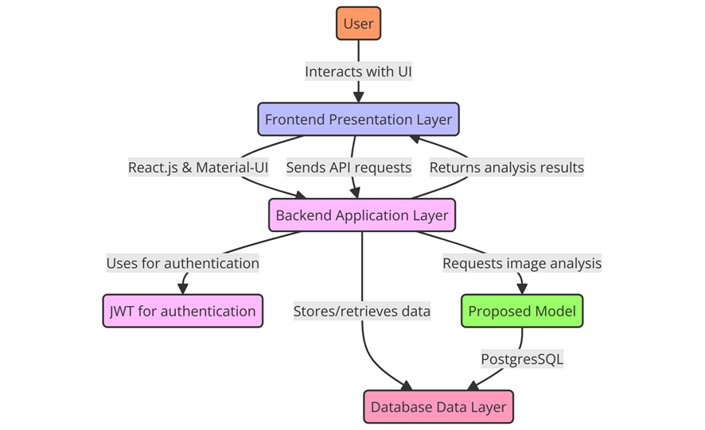
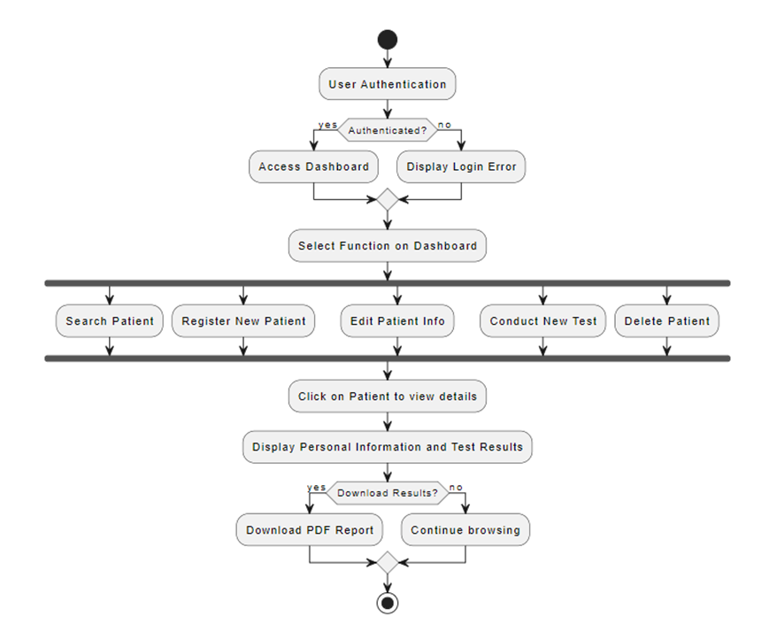
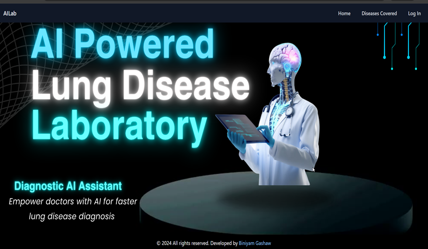
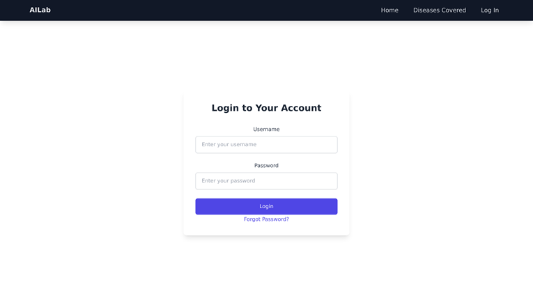
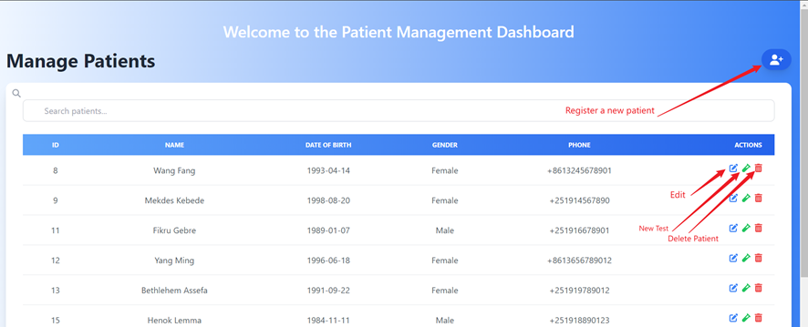
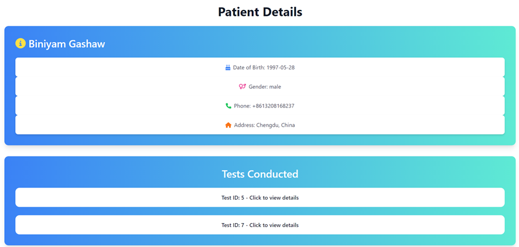
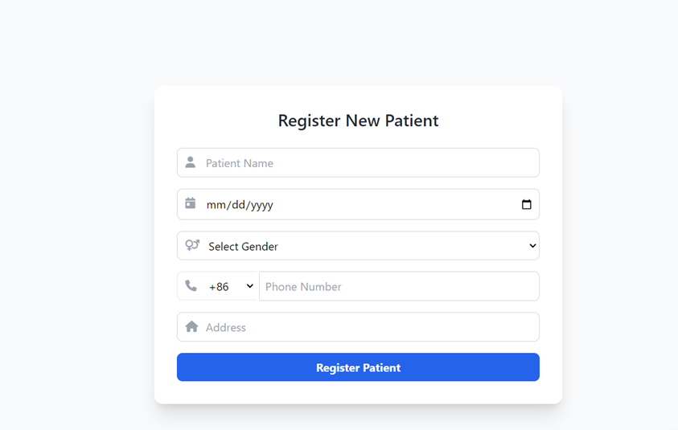
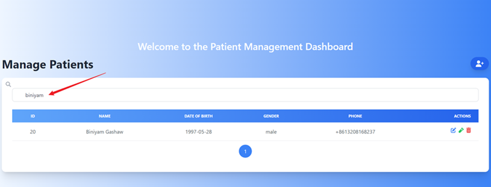
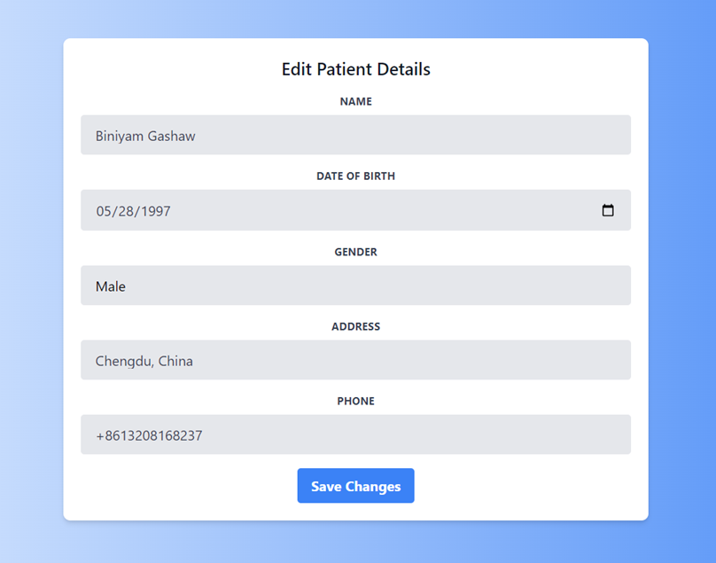
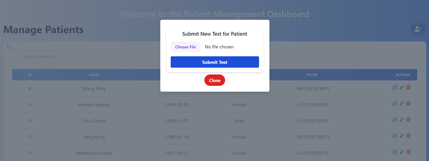

# Lung Disease Classification App

This project is a web application for classifying lung diseases using a trained DenseNet121 model. The application includes a frontend built with React, a backend built with Flask, and a model training module.

## Table of Contents

- [Overview](#overview)
- [Installation](#installation)
- [Usage](#usage)
- [Project Structure](#project-structure)

## Overview

The Lung Disease Classification App aims to classify lung diseases from X-ray images using deep learning. The project is divided into three main parts:

**System Architecture**  
 

1. [Frontend](frontend/README.md): Developed with React.js Material UI and Tailwindcss, the frontend offers a user-friendly dashboard, patient management interface, and diagnostic results display, facilitating user interaction.
2. [Backend](backend/README.md): Powered by Flask, the backend handles RESTful API requests for authentication, data management, image processing, and report generation. It integrates PostgreSQL for efficient data management and ensures secure data transmission with JWT authentication.
3. [Model Training](model_training/README.md): Utilizing TensorFlow, this service analyzes lung X-ray images for disease identification, providing detailed classification results to clinicians. Scripts and notebooks are provided for training the DenseNet121 model, an SE attention-augmented model with an accuracy of 94.81%.

**Activity Diagram**  
 

### Demo Video

Watch a [video demonstration](https://youtu.be/QVxyotvHmtg?si=lyxAyjFoz4F1Ixun) of the application in action.

### Screenshots

Here are some screenshots of the application:

- **Home Page**  
  
- **Login Page**  
  
- **Dashboard Interface**  
  
- **Patient Detail View**  
  
- **Register a New Patient**  
  
- **Search Functionality**  
  
- **Edit Patient Information**  
  
- **New Test Entry**  
  

## Installation

### Prerequisites

Ensure you have the following software installed on your machine:

- Python 3.8+
- Node.js 14+
- npm 6+
- Git

### Backend Installation

1. Navigate to the `backend` directory:
   ```sh
   cd backend
   ```
2. Create a virtual environment and activate it:
   ```sh
   python -m venv venv
   source venv/bin/activate  # On Windows use `venv\Scripts\activate`
   ```
3. Install the required dependencies:
   ```sh
   pip install -r requirements.txt
   ```
4. Set up the environment variables by creating a `.env` file in the `backend` directory. The `.env` file should include the necessary configuration settings.
5. Run the backend server:
   ```sh
   python run.py
   ```

### Frontend Installation

1. Navigate to the frontend directory:
   ```sh
   cd frontend
   ```
2. Install the required dependencies:
   ```sh
   npm install
   ```
3. Start the development server:
   ```sh
   npm start
   ```

## Usage

### Running the Application

1. Ensure the backend server is running:
   ```sh
   cd backend
   source venv/bin/activate  # On Windows use `venv\Scripts\activate`
   python run.py
   ```
2. Ensure the frontend server is running:
   ```sh
   cd frontend
   npm start
   ```
3. Open your web browser and navigate to http://localhost:3000.

4. Login and Upload an image of a lung X-ray to classify the disease.

### Project Structure

```sh
LUNG-DISEASE-CLASSIFICATION-APP/
│
├── backend/
│   ├── README.md
│   ├── app/
│   │   ├── __init__.py
│   │   ├── config.py
│   │   ├── DenseNet121_SE_best_model.h5
│   │   ├── extensions.py
│   │   ├── helpers.py
│   │   ├── models.py
│   │   ├── routes.py
│   ├── migrations/
│   ├── venv/
│   ├── .env
│   ├── populate_database.py
│   ├── requirements.txt
│   ├── run.py
│
├── frontend/
│   ├── README.md
│   ├── node_modules/
│   ├── public/
│   ├── src/
│   │   ├── components/
│   │   ├── pages/
│   │   ├── App.js
│   │   ├── index.js
│   ├── package-lock.json
│   ├── package.json
│
├── model_training/
│   ├── README.md
│   ├── data/
│   ├── models/
│   ├── notebooks/
│   ├── scripts/
│   ├── requirements.txt
│
├── .gitignore
├── README.md

```
