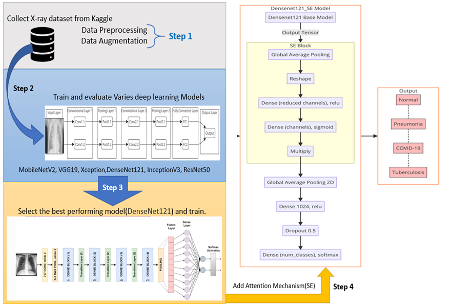

# Model Training

## Dataset

The dataset used for this project can be found on [Kaggle](https://www.kaggle.com/datasets/jtiptj/chest-xray-pneumoniacovid19tuberculosis). It contains chest X-ray images categorized into COVID-19, Normal, Pneumonia, and Tuberculosis.

## Hardware Configuration

The hardware setup for training the models ensures high computational power and memory capacity.

**Hardware Specifications:**

- **OS:** Ubuntu 20.04
- **GPU:** NVIDIA RTX 4090 (24GB)
- **CPU:** 22 vCPU AMD EPYC 7T83 64-Core Processor
- **Memory:** 90GB RAM
- **System Disk:** 30GB
- **Data Disk:** 50GB

## Software Configuration

Model training utilized TensorFlow 2.9.0, known for its robust GPU support.

**Software Specifications:**

- **TensorFlow:** 2.9.0
- **Python:** 3.8
- **CUDA:** 11.2

**Additional Libraries:**

- **NumPy:** 1.22.3
- **Pandas:** 1.4.1
- **Matplotlib:** 3.5.1
- **Scikit-learn:** 1.0.2
- **TensorFlow Datasets:** 4.5.2
- **Keras:** 2.9.0

## Input Parameters for Training

Key parameters impacting model training and performance:

**Training Parameters:**

- **Input Shape:** 224 x 224 x 3
- **Batch Size:** 32
- **Epochs:** 30
- **Early Stopping:** Patience = 10 (Validation Loss)
- **Class Weights:** Dynamic computation for class imbalance
- **Initial Learning Rate:** 0.0001
- **Learning Rate Scheduler:** Factor = 0.2, Patience = 5, Min LR = 1e-6
- **Optimizer:** Adam
- **Pretrained Models:** Xception, DenseNet121, InceptionV3, ResNet50, VGG19, MobileNetV2
- **Attention Mechanisms:** Squeeze-and-Excitation (SE), Convolutional Block Attention Module (CBAM)
- **Transfer Learning:** Fine-tuning with pre-trained ImageNet weights

## Model Evaluation Metrics

Evaluating lung disease detection models using advanced metrics:

### Key Metrics:

- **Accuracy:** Correctly classified predictions proportion.
- **Precision (Specificity):** Correct positive instance identification.
- **Recall (Sensitivity):** Correct identification of actual positive cases.
- **F1 Score:** Balance between precision and recall.
- **Macro F1:** Average F1 scores for each class.
- **Weighted F1:** F1 scores adjusted by class instance count.
- **Confusion Matrix:** Comparison of actual vs. predicted labels.

